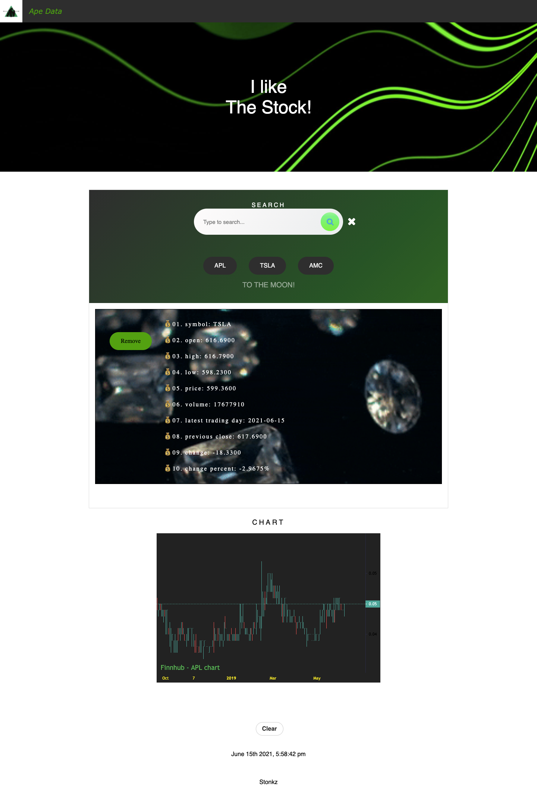

=======

Stock Tracker was created to include:
Interactive search engine to select and track a desired stock.
Current date and time is displayed to allow cross referencing with the stock data shown.
Selected stock is saved to the local storage.
Buttons with the stock's ticker are displayed to quickly switch between the stored stocks.
When a stock is selected, a chart is displayed allowing the user to view the current history.
Clear all button is provided to clear the local storage.
User Story: “As an investor, I want to keep track of my stocks so that I can make smart investment decisions.”

Screenshot of the website shown below:

Screenshot of the homework is displayed

#ProjectData
 
https://github.com/public-apis/public-apis#finance
 
https://docs.google.com/presentation/d/1u2QXEuUCmYjtMSAZoklultbv64mG6F8NOEo66YiLmOI/edit#slide=id.g29f43f0a72_0_0
 

#API
 
https://www.alphavantage.co/documentation/
 
https://finnhub.io/docs/api/authentication
 

#Repo 
 
https://github.com/DavidPedraza95/Finance-Project-One